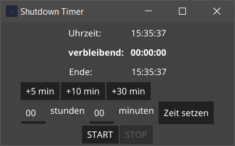

## shutdowntimer

An easy to use crossplatform shutdowntimer based on the GUI-Framework fyne and written in golang. Thanks to the golang it is an easy dropin executable with no external dependencys.

Works on Windows an Linux. No admin or root needed.

## Screenshot Windows 10

